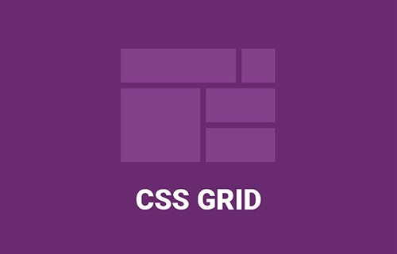

# Curso Grid CSS.
## Conocimientos adquiridos 🏆
1. Contenedor Padre ( Grid Container ).
2. Elementos Hijos ( Grid Items ).
3. Líneas de Cuadrícula ( Grid Lines ).
4. Pista de Cuadrícula ( Grid Track ).
5. Celda de Cuadrícula ( Grid Cell ).
6. Área de Cuadrícula ( Grid Area ).

 

