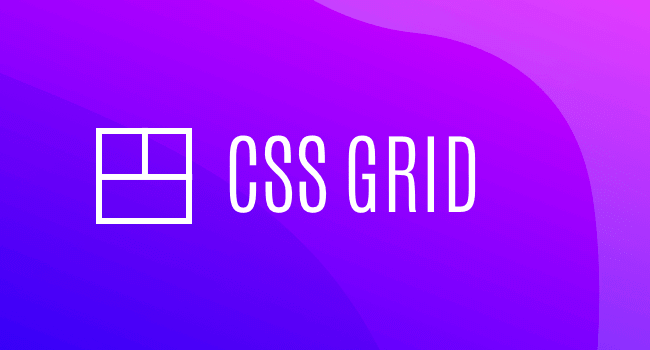

# Prácticas de CSS Grid 🏆.
CSS Grid Layout es el sistema de diseño más potente disponible en CSS. Es un sistema bidimensional, lo que significa que puede manejar tanto columnas como filas, a diferencia de flexbox, que es principalmente un sistema unidimensional.  

